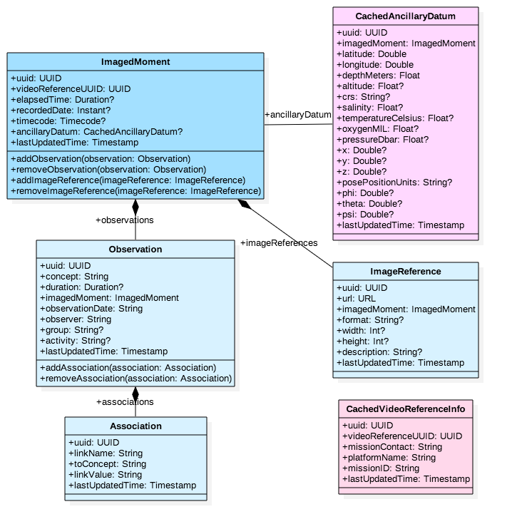
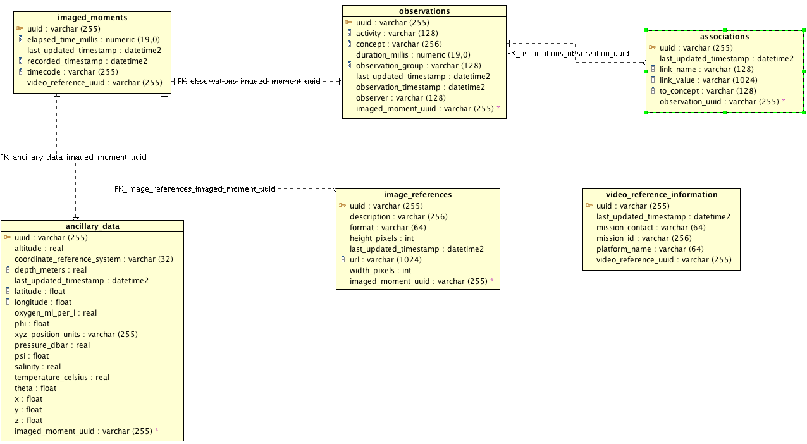

# annosaurus

MBARI is updating its [Video Annotation and Reference System](https://hohonuuli.github.io/vars/) for modern video workflows. The service in this repository is one component of our next generation system. _annosaurus_ is the component that stores and retrieves annotations for a video or images. It is being designed to work as a programming-language agnostic API that can be accessed from any programming language. The goal of this project is to provide a data service that allows developers and scientists to easily build their own tools for annotating video and images collections.

## Design Goals

- Create a web-accessible API for creating, updating and deleting video annotations.
- Use lessons learned from MBARI's video annotation system to create flexible, but searchable video annotations
- This service should stand on it's own and _not require_ any of the other VARS services to function. This is to provide flexibility in how organizations use this service.
- Simplify installation and deployment for organizations. We recognize that many science institutions would benefit from simply installation. 

## Underlying Data Model

### Class Diagram

This model _might_ not be directly exposed to end users. It's the current internal notional data model.



- `ImagedMoment`: Reference to some index in a particular video. It can contain zero or more _Observations_ and zero or more _ImageReferences_. It can use any or all of the following as indices, but at least one _must_ be present:
     - _recordedDate_: The moment in time when the frame or image was recorded
     - _timecode_: Typically this is a tape timecode, but it could be pulled from a timecode track in a video too.
     - _elapsedTime_: This is the time since the start of the video clip. This is the most commonly used index for video files.
- `Observation`: Represents an `annotation`. Includes the annotation term (i.e. concept), an optional duration, and tracks who made the observation. The group and activity fields can be used to further categorize annotations for example at MBARI we might use groups like: _images_, _ROV_, and _AUV_ and activities like: _descent_, _ascent_, _transect_, and _cruising_. 
- `Association`: Information that augments an observation. Very flexible, the format is `linkName | toConcept | linkValue`. Some examples; `eating | Aegina | nil`, `surface-color | self | red`, `audio-comment | nil | first sighting on this mission`. 
- `ImageReference`: Images, such as framegrabs, linked to the moment. It will also be possible to load image references for image annotation projects.
- `CachedAnxillaryData`: For performance reason, we may want to cache some time indexed information, such as position, CTD, etc, in side the same database as the annotations.
- `CachedMissionInfo`: This may contain information describing a camera deployment.

### ER Diagram



## Building

This project is built using [SBT](http://www.scala-sbt.org/). To create the distribution, run `sbt pack`

## Testing

To take it for a quick spin using an in-memory (i.e. temporary) database run the following:

`docker run --name=annosaurus -p 8080:8080  hohonuuli/annosaurus`

You can shut it down using:

```
docker stop annosaurus
docker rm annosaurus
```

Alternatively, you can start it with:

```
export PORT=9090; export CLIENT_SECRET="foo";export SIGNING_SECRET="bar";jetty-main
```

## Deployment

Refer to [DEPLOYMENT.md](DEPLOYMENT.md) for production deployment instructions.

## Usage

We are in the process of putting together an API doc and tutorial on usage. That's just been started but you can see some python examples in [src/pack/bin](src/pack/bin)


## Related Projects

- [vampire-squid](https://github.com/underwatervideo/vampire-squid): A service for registering and locating video files.

## Acknowledgements

We'd like to thank the following companies for kindly donating software for the development of this project:

[](https://auth0.com/?utm_source=oss&utm_medium=gp&utm_campaign=oss)