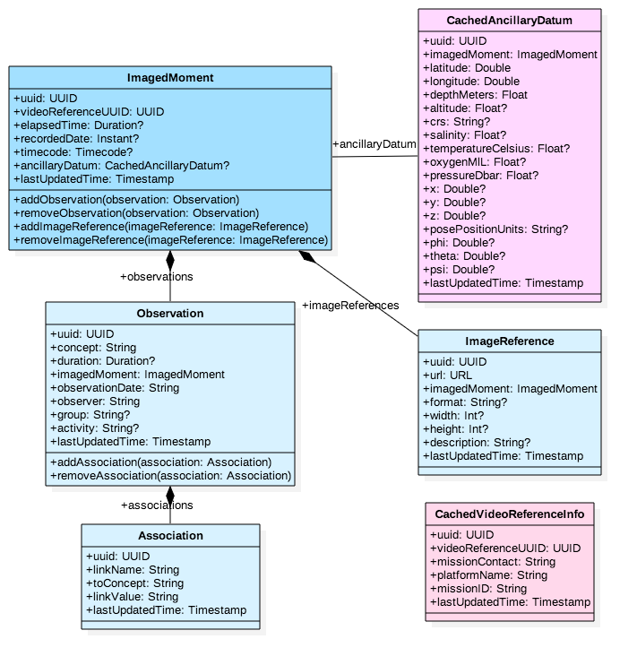
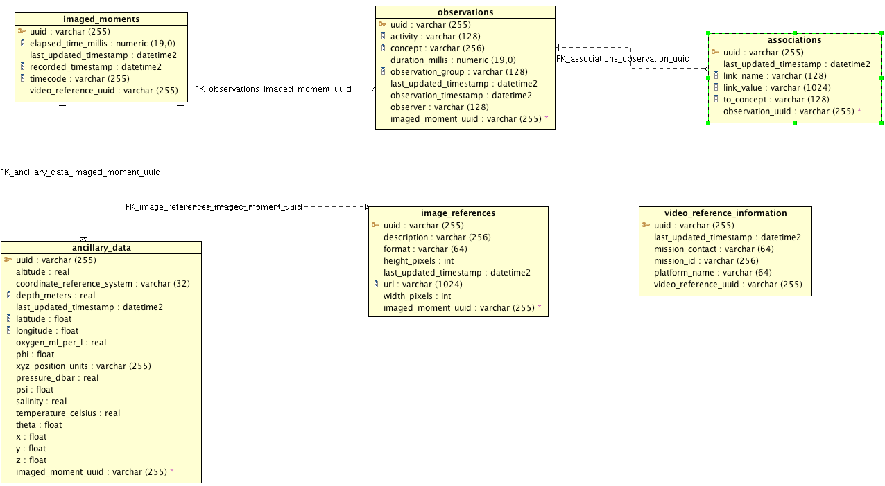

# annosaurus

[](https://deepwiki.com/mbari-org/annosaurus)
 [](https://zenodo.org/badge/latestdoi/90171432)

A RESTful microservice for creating and managing video and image annotations. Built with Scala, Tapir, and Hibernate, annosaurus provides a type-safe, language-agnostic API for annotation management with support for PostgreSQL and SQL Server.

## Features

- **RESTful API** - Programming-language agnostic REST interface with auto-generated Swagger documentation
- **Flexible Indexing** - Support for multiple time indices (recordedDate, timecode, elapsedTime)
- **Rich Annotations** - Complex associations, image references, and cached ancillary data
- **JWT Authentication** - Secure endpoints with JWT Bearer token support
- **Multi-Database Support** - Works with PostgreSQL or SQL Server
- **Database Migrations** - Automated schema management with Flyway
- **Docker Ready** - Available as multi-platform Docker images (amd64/arm64)
- **Health Monitoring** - Built-in health checks and Prometheus metrics

## Quick Start

### Using Docker (Recommended)

**PostgreSQL:**
```bash
docker run -d \
    -p 8080:8080 \
    -e BASICJWT_CLIENT_SECRET="your-client-secret" \
    -e BASICJWT_SIGNING_SECRET="your-signing-secret" \
    -e DATABASE_DRIVER="org.postgresql.Driver" \
    -e DATABASE_URL="jdbc:postgresql://localhost:5432/annotations" \
    -e DATABASE_USER="dbuser" \
    -e DATABASE_PASSWORD="dbpass" \
    -e LOGBACK_LEVEL=INFO \
    --name=annosaurus \
    --restart unless-stopped \
    mbari/annosaurus
```

**SQL Server:**
```bash
docker run -d \
    -p 8080:8080 \
    -e BASICJWT_CLIENT_SECRET="your-client-secret" \
    -e BASICJWT_SIGNING_SECRET="your-signing-secret" \
    -e DATABASE_DRIVER="com.microsoft.sqlserver.jdbc.SQLServerDriver" \
    -e DATABASE_URL="jdbc:sqlserver://localhost:1433;databaseName=annotations" \
    -e DATABASE_USER="dbuser" \
    -e DATABASE_PASSWORD="dbpass" \
    -e LOGBACK_LEVEL=INFO \
    --name=annosaurus \
    --restart unless-stopped \
    mbari/annosaurus
```

Once running, access the Swagger API documentation at `http://localhost:8080/docs`

## Overview

The service in this repository is one component of our [Video Annotation and Reference System](https://github.com/mbari-org/m3-quickstart). _annosaurus_ is a REST-based web service that stores and retrieves annotations for videos and images. It is designed to work as a programming-language agnostic API that can be accessed from any programming language. The goal of this project is to provide a data service that allows developers and scientists to easily build their own tools for annotating video and images collections.

This service stands on its own and does not require any other video annotations services. It does require a database, either PostgreSQL or SQL Server.

## Documentation

- [Security Handshake](annosaurus/src/site/docs/howto/security_handshake.md)
- [Developer Guide (CLAUDE.md)](CLAUDE.md) - Architecture and development patterns
- [Deployment Guide](annosaurus/src/site/docs/DEPLOYMENT.md) - Production deployment

## Data Model

### Class Diagram



- `ImagedMoment`: Reference to some index in a particular video. It can contain zero or more _Observations_ and zero or more _ImageReferences_. It can use any or all of the following as indices, but at least one _must_ be present:

  - _recordedDate_: The moment in time when the frame or image was recorded
  - _timecode_: Typically this is a tape timecode, but it could be pulled from a timecode track in a video too.
  - _elapsedTime_: This is the time since the start of the video clip. This is the most commonly used index for video files.

- `Observation`: Represents an `annotation`. Includes the annotation term (i.e. concept), an optional duration, and tracks who made the observation. The group and activity fields can be used to further categorize annotations for example at MBARI we might use groups like: _images_, _ROV_, and _AUV_ and activities like: _descent_, _ascent_, _transect_, and _cruising_.
- `Association`: Information that augments an observation. Very flexible, the format is `linkName | toConcept | linkValue`. Some examples; `eating | Aegina | nil`, `surface-color | self | red`, `audio-comment | nil | first sighting on this mission`.
- `ImageReference`: Images, such as framegrabs, linked to the moment. It will also be possible to load image references for image annotation projects.
- `CachedAnxillaryData`: For performance reason, we may want to cache some time indexed information, such as position, CTD, etc, in side the same database as the annotations.
- `CachedMissionInfo`: This may contain information describing a camera deployment.

### ER Diagram



## Prerequisites

- **JDK 21** - Required for building and running
- **SBT** - Scala Build Tool for compilation
- **Database** - PostgreSQL 12+ or SQL Server 2019+
- **Docker** (optional) - For containerized deployment

## Building from Source

This project uses [SBT (Scala Build Tool)](http://www.scala-sbt.org/).

```bash
# Compile the project
sbt compile

# Build a distribution
sbt stage

# The compiled application will be at:
# annosaurus/target/universal/stage/

# Run the service
annosaurus/target/universal/stage/bin/annosaurus
```

### Building Docker Image

```bash
# First, stage the application
sbt stage

# Build the Docker image
docker build -t mbari/annosaurus .
```

## Configuration

The service is configured through `application.conf` or environment variables. Key configuration options:

| Environment Variable | Description | Example |
|---------------------|-------------|---------|
| `DATABASE_URL` | JDBC connection URL | `jdbc:postgresql://localhost:5432/annotations` |
| `DATABASE_DRIVER` | JDBC driver class | `org.postgresql.Driver` |
| `DATABASE_USER` | Database username | `dbuser` |
| `DATABASE_PASSWORD` | Database password | `dbpass` |
| `BASICJWT_CLIENT_SECRET` | JWT client secret | `your-secret` |
| `BASICJWT_SIGNING_SECRET` | JWT signing secret | `your-secret` |
| `HTTP_PORT` | HTTP server port | `8080` |
| `LOGBACK_LEVEL` | Logging level | `INFO`, `DEBUG`, `WARN` |

For complete configuration options, see `annosaurus/src/universal/conf/application.conf`.

## API Documentation

Once the service is running, Swagger documentation is available at:
- `http://localhost:8080/docs` (interactive API explorer)

### Authentication

Most endpoints require JWT authentication. Include the token in the Authorization header:
```bash
Authorization: Bearer <your-jwt-token>
```

Generate a JWT token using the `/auth/authorize` endpoint.

### Example API Calls

**Create an annotation:**
```bash
curl -X POST http://localhost:8080/v1/observations \
  -H "Authorization: Bearer <token>" \
  -H "Content-Type: application/json" \
  -d '{
    "concept": "Nanomia bijuga",
    "observer": "researcher",
    "videoReferenceUuid": "uuid-here",
    "recordedTimestamp": "2024-01-15T10:30:00Z"
  }'
```

**Query annotations:**
```bash
curl -X GET "http://localhost:8080/v1/query?concept=Nanomia%20bijuga" \
  -H "Authorization: Bearer <token>"
```

## Testing

The project includes comprehensive integration tests for both PostgreSQL and SQL Server.

```bash
# Run unit tests
sbt annosaurus/test

# Run PostgreSQL integration tests
sbt itPostgres/test

# Run SQL Server integration tests
sbt itSqlserver/test

# Run a specific test suite
sbt "itPostgres/testOnly org.mbari.annosaurus.endpoints.PostgresAnnotationEndpointsSuite"
```

## Development

For developers working on annosaurus, see [CLAUDE.md](CLAUDE.md) for detailed architecture documentation, development workflows, and coding patterns.

### Technology Stack

- **Scala 3.7.4** - Primary programming language
- **Tapir** - Type-safe REST API framework
- **Vert.x** - Async HTTP server
- **Hibernate/JPA** - ORM for database persistence
- **Circe** - JSON serialization
- **Flyway** - Database migration management
- **HikariCP** - Connection pooling
- **MUnit** - Testing framework
- **Testcontainers** - Integration testing with real databases

## Deployment

Refer to [DEPLOYMENT.md](annosaurus/src/site/docs/DEPLOYMENT.md) for production deployment instructions, including:
- Kubernetes deployment
- Database setup and migrations
- Performance tuning
- Monitoring and logging


## Related Projects

This service is part of MBARI's [Video Annotation and Reference System](https://github.com/mbari-org/m3-quickstart):

- [vampire-squid](https://github.com/mbari-org/vampire-squid) - Video asset management service
- [m3-quickstart](https://github.com/mbari-org/m3-quickstart) - Complete system deployment guide

## Contributing

Contributions are welcome! Please:

1. Fork the repository
2. Create a feature branch (`git checkout -b feature/your-feature`)
3. Make your changes and add tests
4. Ensure all tests pass (`sbt test itPostgres/test itSqlserver/test`)
5. Commit your changes (`git commit -am 'Add new feature'`)
6. Push to the branch (`git push origin feature/your-feature`)
7. Create a Pull Request

## License

This project is licensed under the Apache License 2.0 - see the LICENSE file for details.

## Support

- **Issues**: Report bugs or request features via [GitHub Issues](https://github.com/mbari-org/annosaurus/issues)
- **Documentation**: See the [Swagger API docs](http://localhost:8080/docs) and [CLAUDE.md](CLAUDE.md)
- **Organization**: [Monterey Bay Aquarium Research Institute (MBARI)](https://www.mbari.org)
