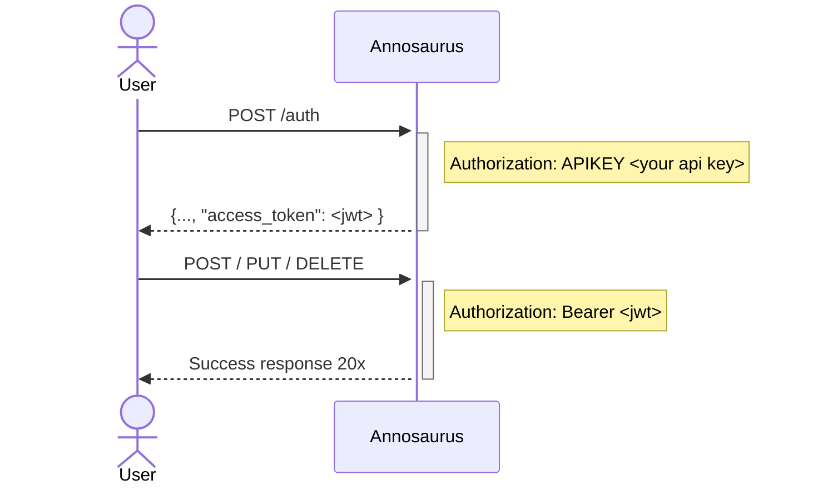

# Security Handshake

All endpoints that can mutate the database require an `Authorization: Bearer <jwt_token>` header. Obtain a JWT token by sending a `POST /auth` request with your API key:

```text
POST /anno/v1/auth
Authorization: APIKEY <your_api_key>
```

Example using curl:

```bash
curl -X 'POST' \
  'http://myserver.org/anno/v1/auth' \
  -H 'Authorization: APIKEY <your_api_key>'
```

The response includes an `access_token` field containing the JWT. Pass that token in all subsequent mutating requests.

## Security Flow


