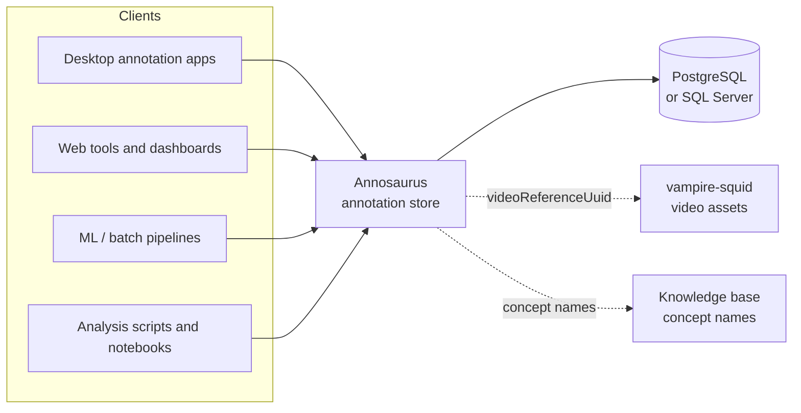

# Overview

Annosaurus is a REST web service that stores and serves annotations for video and imagery. It is the annotation store behind MBARI's Video Annotation and Reference System (VARS), but it has no dependency on any particular annotation application: anything that can speak HTTP and JSON can read and write annotations with it.

The full VARS stack is packaged as a quickstart deployment: [vars-quickstart-public](https://github.com/mbari-org/vars-quickstart-public) for use outside MBARI, and [vars-quickstart-mbari](https://github.com/mbari-org/vars-quickstart-mbari) for MBARI deployments.

## The problem it solves

Research organizations that collect underwater video and imagery accumulate observations about what appears in that media — what organism was seen, when, where, at what depth, by whom, and with what supporting detail. Historically that information ends up locked inside whatever desktop application created it, in a schema that application owns.

Annosaurus separates the annotations from the tools that create them:

- **One authoritative store.** Desktop annotation apps, browser tools, batch importers, and machine-learning pipelines all write to the same service, so there is a single copy of the annotations to query, back up, and publish.
- **Language and platform agnostic.** The API is plain HTTP plus JSON, so clients can be written in Java, Python, JavaScript, Scala, R, or anything else. No shared database driver or ORM is required.
- **Media-agnostic.** An annotation is anchored to a *video reference* plus a time index, so the same model works for recorded ROV dives, AUV image sequences, and standalone still-image collections.
- **Built for analysis, not just capture.** Alongside CRUD endpoints there are bulk-load, multi-constraint query, and aggregation endpoints intended for the "give me everything about X" access patterns that analysis and reporting need.

## Where it fits

Annosaurus owns annotations and nothing else. It deliberately does not manage the media files, the taxonomy, or the accounts — those belong to sibling services, and annosaurus refers to them by UUID or by name.

| Concern | Owner |
| --- | --- |
| Annotations, associations, framegrab references, cached ancillary data | **Annosaurus** |
| Video and image files, their URLs and durations | [vampire-squid](https://github.com/mbari-org/vampire-squid) |
| Valid concept names and taxonomy | Knowledge base service |
| Users, API keys, roles | The identity service that issues annosaurus API keys |

The link between annosaurus and the media is the `videoReferenceUuid`. Clients obtain that UUID from the video asset manager and use it as the key for every annotation call.

## What it stores

The model is a small hierarchy anchored to a moment in a video:

- **ImagedMoment** — a point in a specific video reference, indexed by `recordedTimestamp`, `timecode`, and/or `elapsedTime`. It holds the observations and images at that moment.
- **Observation** — a single annotation: a concept, the observer who made it, a timestamp, and optional duration, `group`, and `activity`.
- **Association** — structured detail attached to an observation, in `linkName | toConcept | linkValue` form (for example `eating | Aegina | nil` or `surface-color | self | red`). Associations are how new kinds of detail — behavior, measurements, bounding boxes, free-text comments — get added without schema changes.
- **ImageReference** — a framegrab or still image at the moment, identified by URL.
- **CachedAncillaryDatum** — position, depth, CTD, and vehicle-pose values recorded alongside the annotation so that spatial and environmental queries do not require a join to an external sensor archive.
- **CachedVideoReferenceInfo** — deployment metadata (platform, mission ID, contact) cached from the video asset service.

See the [class diagram in the README](https://github.com/mbari-org/annosaurus#data-model) for the full field list.

## What you can do with it

- **Create and edit annotations** one at a time, or in bulk when importing an existing dataset or the output of a detection model.
- **Fetch annotations fast** for one video, many videos, a time window across videos, or a concept — see [Fetching Annotations](howto/fetch_annotations.md).
- **Run multi-constraint queries** across concept, observer, platform, time, depth, and geography for dataset assembly — see [Advanced Queries](howto/advanced-queries.md).
- **Aggregate** with count and histogram endpoints (by concept, depth, time) for summaries and QA/QC.
- **Attach and manage imagery** — link framegrabs to moments and update their URLs when media moves.
- **Attach ancillary data** — bulk-load position and CTD values against recorded timestamps.
- **React to changes** — optionally publish `CREATED`/`UPDATED`/`DELETED` notifications to a NATS topic so downstream systems can stay in sync.

## What it does not do

- It does not store or serve video or image files, only URLs pointing at them.
- It does not validate concept names against a taxonomy; that is the client's or the knowledge base's job.
- It does not manage users. It verifies a JWT that it issued in exchange for an API key — see [Security Handshake](howto/security_handshake.md).
- It ships no user interface. The only built-in page is the Swagger explorer at `/docs`.

## Typical uses at MBARI

- Annotators watching ROV dive video record observations live from a desktop application; the annotations land in annosaurus as they are made.
- AUV and camera-system imagery is annotated in bulk, with each image treated as an imaged moment carrying an image reference.
- Machine-learning detections are loaded through the bulk endpoints and reviewed later by a human, with the reviewer's edits going to the same records.
- Scientists pull annotations by concept or by dive into notebooks and analysis scripts for publication-quality datasets.

## Getting started

The service is self-contained: it needs a PostgreSQL or SQL Server database and nothing else. Schema migrations run automatically at startup.

1. Deploy it — see the [Deployment guide](DEPLOYMENT.md), or bring up the whole VARS stack with [vars-quickstart-public](https://github.com/mbari-org/vars-quickstart-public) (or [vars-quickstart-mbari](https://github.com/mbari-org/vars-quickstart-mbari) at MBARI).
2. Get a token — see [Security Handshake](howto/security_handshake.md).
3. Read some annotations — see [Fetching Annotations](howto/fetch_annotations.md).
4. Explore the full API at `/docs` on your running instance.
