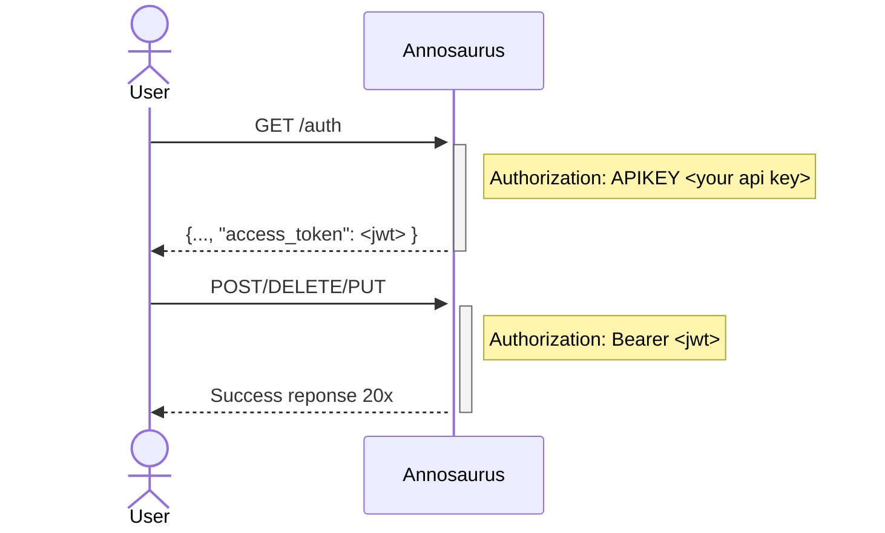

# Security Handshake

All endpoints that can mutate the database require a header of `Authorization: Bearer <jwt_token>`. You can obtain a JWT token by submitting a `POST /auth` request like the following:

```text


```

