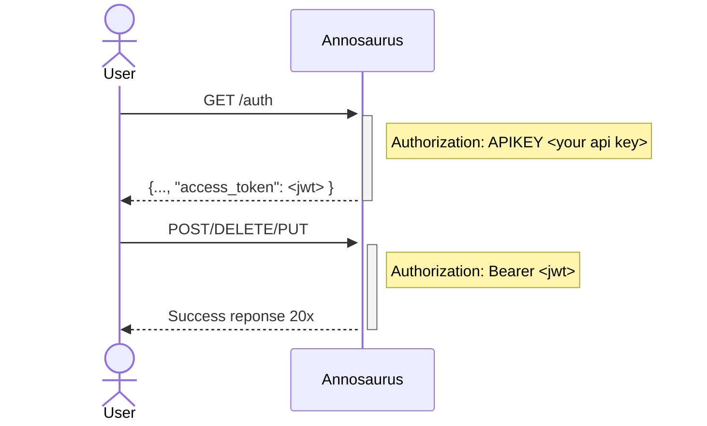

# Security Handshake

All endpoints that can mutate the database require a header of `Authorization: Bearer <jwt_token>`. You can obtain a JWT token by submitting a `POST /auth` request such as the following:

```text
POST  http://myserver.org/anno/v1/auth
Authorization: APIKEY foobar
```

Example using curl:

```bash
curl -X 'POST' \
  'http://m3.shore.mbari.org/anno/v1/auth' \
  -H 'Authorization: APIKEY <your_api_key>'
```

## Security flow diagram


